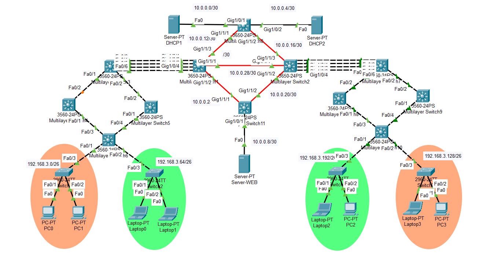

# Manual Técnico

## 1. Direcciones IP utilizadas
|**Dispositivo**|**Dirección IP**|**Máscara de Subred**|**Gateway**|
|:---:|:---:|:---:|:---:|
|PC0    | 192.168.3.5 | 255.255.255.192 | 192.168.3.1 | 
|PC1| 192.168.3.4 | 255.255.255.192 | 192.168.3.1 |  
|Laptop0    | 192.168.3.69 | 255.255.255.192 | 192.168.3.65 |  
|Laptop1| 192.168.3.71 | 255.255.255.192 | 192.168.3.65 |  
|Laptop2    | 192.168.3.197 | 255.255.255.192 | 192.168.3.193 |  
|PC2| 192.168.3.198 | 255.255.255.192 | 192.168.3.193 | 
|Laptop3    | 192.168.3.132 | 255.255.255.192 | 192.168.3.129 |
|PC3| 192.168.3.133 |  255.255.255.192 | 192.168.3.129 | 


## 2. Topología de red




## 3. Comandos utilizados


### creacion y configuracion de vlans

```
creacion vlans ------------------------------------
ena 
conf t
vlan 13
name VLAN_Naranja_Grupo_3
vlan 23
name VLAN_Verde_Grupo_3
exit
```

##### Multilayer Switch0 

```
Multilayer Switch0 ------------------------------------
vtp mode server
vtp version 2
vtp domain g3
vtp password g3
int range GigabitEthernet 1/1/1-2
switchport mode trunk
switchport trunk allowed vlan all
exit
do write
```

##### Multilayer Switch1 
```
Multilayer Switch1 ------------------------------------
ena
conf t
vtp mode client
vtp domain g3
vtp password g3
int range gigabitEthernet 1/1/1-3
switchport mode trunk
switchport trunk encapsulation dot1q
switchport trunk allowed vlan all
exit
do write
```
##### Multilayer Switch2
```
Multilayer Switch2 ------------------------------------
ena
conf t
vtp mode client
vtp domain g3
vtp password g3
int range gigabitEthernet 1/1/1-3
switchport mode trunk
switchport trunk encapsulation dot1q
switchport trunk allowed vlan all
exit
do write
```


##### Multilayer Switch11

```
Multilayer Switch11 ------------------------------------
ena 
conf t
vtp mode client
vtp domain g3
vtp password g3
int range GigabitEthernet 1/1/1-2
switchport mode trunk
switchport trunk allowed vlan all
exit
do write
```
#####  Multilayer Switch3, Switch7, Switch1, Switch2

```
Multilayer Switch3, Switch7, Switch1, Switch2 ----------
ena 
conf t
vtp mode client
vtp domain g3
vtp password g3
interface Port-channel 1
switchport mode trunk
switchport trunk encapsulation dot1q
switchport trunk allowed vlan 13,23
```
###### Multilayer Switch4, Switch5, Switch8, Switch9
```
Multilayer Switch4, Switch5, Switch8, Switch9 -------------
ena 
conf t
vtp mode client
vtp domain g3
vtp password g3
interface range fa 0/1-2
switchport mode trunk
switchport trunk encapsulation dot1q
switchport trunk allowed vlan 13,23
```
##### Multilayer Switch6, Switch10
```
Multilayer Switch6, Switch10 ---------------------------
ena 
conf t
vtp mode client
vtp domain g3
vtp password g3
interface range fa 0/3-4
switchport mode trunk
switchport trunk encapsulation dot1q
switchport trunk allowed vlan 13,23
```

### configuracion de  LACP
Para mejorar la eficiencia en la transmisión de datos se ha configurado LACP utilizando tres puertos. Esta agrupación de enlaces permite una mayor capacidad de ancho de banda y ofrece redundancia, garantizando una comunicación eficiente entre los distintos edificios.


##### Multilayer Switch3

```
Multilayer Switch3 ---------------------------
ena
conf t
int range fa0/3-6
channel-protocol lacp
channel-group 1 mode passive
exit
do wr
```

##### Multilayer Switch1

``` 
Multilayer Switch1 ---------------------------
ena
conf t
int range GigabitEthernet 1/0/1-4
channel-protocol lacp
channel-group 1 mode active
exit
do wr
```

##### Multilayer Switch3

```
Multilayer Switch3 ---------------------------
ena
conf t
int range GigabitEthernet 1/0/1-4
channel-protocol lacp
channel-group 1 mode active
exit
do wr
``` 

##### Multilayer Switch7

```
Multilayer Switch7 ---------------------------
ena
conf t
int range fa0/3-6
channel-protocol lacp
channel-group 1 mode passive
exit
do wr
```

### Ruteo EIGRP

Se implementó el protocolo de enrutamiento EIGRP para interconectar de manera eficiente los diferentes edificios, garantizando el enrutamiento dinámico y optimizado del tráfico de red entre ellos. 

```
en
conf t
router eigrp 3
no auto-summary
do wr
end
exit
```


##### Multilayer Switch1

``` 
Multilayer Switch1 ---------------------------

enable
conf t
interface port-channel 1
interface vlan 13
ip address 192.168.3.1 255.255.255.192
exit
interface port-channel 1
interface vlan 23
ip address 192.168.3.65 255.255.255.192
exit
do wr

en
conf t
int gig1/1/3
no sw
no switchport 

ip ad
ip address 10.0.0.14 255.255.255.252
no sh
exit
int gig1/1/1
no sw
no switchport 

ip ad
ip address 10.0.0.29 255.255.255.252
no sh
exit
int gig1/1/2
no sw
no switchport 

ip ad
ip address 10.0.0.26 255.255.255.252
no sh
exit
do wr

ip routing
router eigrp 3
network 192.168.3.0 0.0.0.63
network 192.168.3.64 0.0.0.63
network 10.0.0.12 0.0.0.3
network 10.0.0.28 0.0.0.3
network 10.0.0.24 0.0.0.3
no auto-summary
exit
do wr
```


##### Multilayer Switch2

``` 
Multilayer Switch2 ---------------------------

enable
conf t
interface port-channel 1
interface vlan 13
ip address 192.168.3.129 255.255.255.192
exit
interface port-channel 1
interface vlan 23
ip address 192.168.3.193 255.255.255.192
exit
do wr
int gig1/1/3
no sw
no switchport 

ip ad
ip address 10.0.0.18 255.255.255.252
no sh
exit
int gig1/1/1
no sw
no switchport 

ip ad
ip address 10.0.0.30 255.255.255.252
no sh
exit
int gig1/1/2
no sw
no switchport 

ip ad
ip address 10.0.0.22 255.255.255.252
no sh
exit
do wr

ip routing
router ei
router eigrp 3
network 10.0.0.16 0.0.0.3
network 10.0.0.28 0.0.0.3
network 10.0.0.20 0.0.0.3
network 192.168.3.192 0.0.0.63
network 192.168.3.128 0.0.0.63
no auto-summary
exit
do wr
``` 


##### Multilayer Switch11

```
Multilayer Switch11 ---------------------------

en
conf t
int gig1/1/1
no sw
no switchport 

ip ad
ip address 10.0.0.25 255.255.255.252
no sh
exit
int gig1/0/1
ip ad
no sw
no switchport 


ip ad
ip address 10.0.0.9 255.255.255.252
no sh
exit
int gig1/1/2
no sw
no switchport 

ip ad
ip address 10.0.0.21 255.255.255.252
exit
do wr

ip routing
router eigrp 3
network 10.0.0.8 0.0.0.3
network 10.0.0.24 0.0.0.3
network 10.0.0.20 0.0.0.3
no auto-summary
exit
do wr
```

##### Multilayer Switch 0

```
Multilayer Switch0 ---------------------------

en
conf t
int gig1/0/1
no switchport 

ip ad
ip address 10.0.0.1 255.255.255.252
no sh
exit
int gig1/0/2
no switchport 
ip address 10.0.0.5 255.255.255.252
no sh
exit
int gig1/1/1
no switchport 
ip address 10.0.0.13 255.255.255.252
no sh
exit
int gig1/1/2
no sw
no switchport 
ip address 10.0.0.17 255.255.255.252
no sh
exit
do wr

ip routing
router eigrp 3
network 10.0.0.0 0.0.0.3
network 10.0.0.4 0.0.0.3
network 10.0.0.12 0.0.0.3
network 10.0.0.16 0.0.0.3
no auto-summary
exit
do wr
```


### Configuracion de HSRP
Posteriormente, en cada edificio se configuro HSRP, de este modo, se utilizo en cada lado un Multilayer en modo activo y otro en modo pasivo, por lo que al tener fallo en algun Multilayer,  el otro tomará el control automáticamente, manteniendo la continuidad de la red sin interrupciones.

##### Multilayer Switch4
```
Multilayer Switch4 ---------------------------

en
conf t
int vlan 13
ip address 192.168.3.3 255.255.255.0  
standby 2 ip 192.168.3.1             
standby 2 priority 160                 
standby 2 preempt   

int vlan 23
ip address 192.168.3.67 255.255.255.0  
standby 1 ip 192.168.3.65              
standby 1 priority 150                
standby 1 preempt   

```


##### Multilayer Switch8
```
Multilayer Switch8 ---------------------------
en
conf t
int vlan 13
ip address 192.168.3.131 255.255.255.0  
standby 2 ip 192.168.3.129            
standby 2 priority 160                 
standby 2 preempt   

int vlan 23
ip address 192.168.3.195 255.255.255.0  
standby 1 ip 192.168.3.193             
standby 1 priority 150                
standby 1 preempt   
```

### Configuracion de ACL

Finalmente, se implementaron listas de control de acceso (ACL) para restringir la comunicación entre las VLANs, garantizando que únicamente los dispositivos pertenecientes a la misma VLAN puedan comunicarse entre sí.
```
Switch Multicapa 3

access-list 103 deny icmp 192.168.3.0 0.0.0.63 192.168.3.192 0.0.0.63 echo
access-list 103 deny icmp 192.168.3.0 0.0.0.63 192.168.3.192 0.0.0.63 echo-reply
access-list 103 deny icmp 192.168.3.64 0.0.0.63 192.168.3.128 0.0.0.63 echo
access-list 103 deny icmp 192.168.3.64 0.0.0.63 192.168.3.128 0.0.0.63 echo-reply
access-list 103 permit icmp any any echo
access-list 103 permit icmp any any echo-reply
access-list 103 permit ip any any

interface port-channel 2 
ip access-group 103 out


Switches Multicapa 4 y 5

access-list 103 deny icmp 192.168.3.0 0.0.0.63 192.168.3.64 0.0.0.63 echo
access-list 103 deny icmp 192.168.3.0 0.0.0.63 192.168.3.64 0.0.0.63 echo-reply

access-list 103 permit icmp any any echo
access-list 103 permit icmp any any echo-reply
access-list 103 permit ip any any
interface vlan 13 
ip access-group 103 in


Switches Multicapa 8 y 9

access-list 103 deny icmp 192.168.3.128 0.0.0.63 192.168.3.192 0.0.0.63 echo
access-list 103 deny icmp 192.168.3.128 0.0.0.63 192.168.3.192 0.0.0.63 echo-reply

access-list 103 permit icmp any any echo
access-list 103 permit icmp any any echo-reply
access-list 103 permit ip any any
interface vlan 13 
ip access-group 103 in
```


