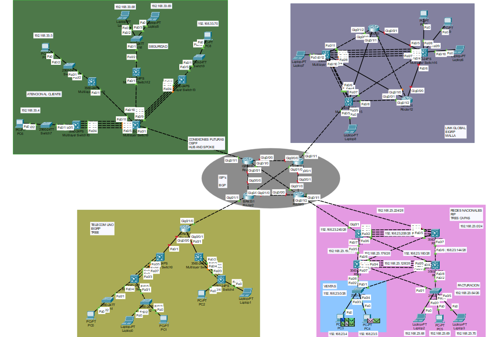

# Manual Técnico

## 1. Direcciones IP utilizadas
|**Dispositivo**|**Dirección IP**|**Máscara de Subred**|**Gateway**|
|:---:|:---:|:---:|:---:|
|PC0    | 192.168.13.10 | 255.255.255.192 | 192.168.13.5 | 
|PC1| 192.168.13.84 | 255.255.255.192 | 192.168.13.69 |  
|Laptop0    | 192.168.13.74 | 255.255.255.192 | 192.168.13.69 |  
|Laptop1| 192.168.13.148 | 255.255.255.192 | 192.168.13.133 | 
|PC2| 192.168.13.138 | 255.255.255.192 | 192.168.13.133 | 
|Laptop2    | 192.168.23.68 | 255.255.255.192 | 192.168.23.65 |  
|Laptop3    | 192.168.23.70 | 255.255.255.192 |192.168.23.65 |
|PC3| 192.168.23.4 |  255.255.255.192 | 192.168.23.1 | 
|PC4| 192.168.23.5 |  255.255.255.192 | 192.168.23.1 | 
|PC5| 192.168.23.69 |  255.255.255.192 | 192.168.23.65 | 
|PC6| 192.168.33.4 |  255.255.255.240 | 192.168.33.1 |
|PC7| 192.168.33.20 |  255.255.255.240 | 192.168.33.17 |
|PC8| 192.168.33.50 |  255.255.255.240 | 192.168.33.49 |
|Laptop4    | 192.168.33.35 | 255.255.255.240 |192.168.33.33 |
|Laptop5    | 192.168.33.36 | 255.255.255.240 |192.168.33.33 |
|Laptop6    | 192.168.43.30 | 255.255.255.192 |192.168.43.5 |
|Laptop7    | 192.168.43.75 | 255.255.255.192 |192.168.43.69 |
|PC9| 192.168.43.20 |  255.255.255.192 | 192.168.43.5 |
|PC10| 192.168.43.10 |  255.255.255.192 | 192.168.43.5 |


|**NOMBRE**|**VLAN**|
|:---:|:---:|
|VENTAS    | 10 | 
|FACTURACION| 20 | 
|AtencionAlCliente    | 30 | 
|SEGURIDADAD| 40 | 
|DESARROLLO    | 50 | 
|INVESTIGACION | 60 |
|SOPORTE    | 70 | 
|ADMINISTRACION | 80 |

## 2. Topología de red




## 3. Comandos utilizados


## REDES NACIONALES

## LACP

### R1-1
```
R1 ------------------------------------
int range fa 0/1-4
channel-protocol lacp
channel-group 1 mode active
exit
do wr
```

### R1-2
```
R2 ------------------------------------
int range fa 0/1-4
channel-protocol lacp
channel-group 1 mode passive
exit
do wr
```

### R1-3
```
RN-3 ------------------------------------
int range fa 0/1-4
channel-protocol lacp
channel-group 1 mode active
exit
do wr
```

### R1-4
```
RN-4 ------------------------------------
int range fa 0/1-4
channel-protocol lacp
channel-group 1 mode passive
exit
do wr
```

### HSRP

### R1-3
```
RN-3 ------------------------------------
int fa 0/8
no switchport
ip address 192.168.23.2 255.255.255.192
standby version 2
standby 10 ip 192.168.23.1
standby 10 priority 160
standby 10 preempt
exit
int fa 0/7
no switchport
ip address 192.168.23.66 255.255.255.192
standby version 2
standby 20 ip 192.168.23.65
standby 20 priority 160
standby 20 preempt
exit
do wr
```

### R1-4
```
RN-4 ------------------------------------
int fa 0/7
no switchport
ip address 192.168.23.3 255.255.255.192
standby version 2
standby 10 ip 192.168.23.1
exit
int fa 0/8
no switchport
ip address 192.168.23.67 255.255.255.192
standby version 2
standby 20 ip 192.168.23.65
exit
do wr
```

### VLANS

### RN-1, RN-2, RN-3, RN-4

```
RN-1, RN-2, RN-3, RN-4 ------------------------------------
vlan 10
name VENTAS
vlan 20
name FACTURACION
exit
do wr
```


### RIP
### RN-1

```
RN-1 ------------------------------------
int port-channel 1
no switchport
ip add 192.168.23.209 255.255.255.240
exit
int fa 0/7
no switchport
ip add 192.168.23.194 255.255.255.240
exit
int fa 0/6
no switchport
ip add 192.168.23.162 255.255.255.240
exit
int fa 0/5
no switchport
no ip add 192.168.23.241 255.255.255.240
exit
ip routing
do sh ip route
router rip
version 2
network 192.168.23.0
network 192.168.23.160
network 192.168.23.192
network 192.168.23.208
network 192.168.23.240
exit
do wr
```
### RN-2

```
RN-2 ------------------------------------
int port-channel 1
no switchport
ip add 192.168.23.210 255.255.255.240
exit
int fa 0/7
no switchport
ip add 192.168.23.146 255.255.255.240
exit
int fa 0/6
no switchport
ip add 192.168.23.178 255.255.255.240
exit
int fa 0/5
no switchport
ip add 192.168.23.225 255.255.255.240
exit
ip routing
do sh ip route
router rip
version 2
network 192.168.23.0
network 192.168.23.144
network 192.168.23.176
network 192.168.23.208
network 192.168.23.224
exit
do wr
```

### RN-3
```
RN-3 ------------------------------------
int port-channel 1
no switchport
ip add 192.168.23.129 255.255.255.240
exit
int fa 0/5
no switchport
ip add 192.168.23.193 255.255.255.240
exit
int fa 0/6
no switchport
ip add 192.168.23.177 255.255.255.240
exit
ip routing
router rip
version 2
network 192.168.23.0
network 192.168.23.64
network 192.168.23.128
network 192.168.23.176
network 192.168.23.192
exit
do wr
```
### RN-4
```
RN-4 ------------------------------------
int port-channel 1
no switchport
ip add 192.168.23.130 255.255.255.240
exit
int fa 0/5
no switchport
ip add 192.168.23.161 255.255.255.240
exit
int fa 0/6
no switchport
ip add 192.168.23.145 255.255.255.240
exit
router rip
version 2
network 192.168.23.0
network 192.168.23.64
network 192.168.23.128
network 192.168.23.144
network 192.168.23.160
exit
do wr
```


## CONEXIONES FUTURAS

## OSPF

### MS-9
```
MS-9 ------------------------------------
int range fa 0/2-5
channel-protocol lacp
channel-group 1 mode active
exit
do wr

int range fa 0/6-9
channel-protocol lacp
channel-group 2 mode passive
exit
do wr
```

### MS-10
```
MS-10 ------------------------------------
ena
conf t
int range fa0/1-4
channel-protocol lacp
channel-group 1 mode passive
exit
do wr
```

### MS-13
```
MS-13 ------------------------------------
ena
conf t
int range fa0/1-4
channel-protocol lacp
channel-group 2 mode passive
exit
do wr
```


### VLANS

### MS13, MS12, MS11, MS10, MS9

```
MS13, MS12, MS11, MS10, MS9 ------------------------------
vlan 30
name AtencionAlCliente
vlan 40
name Seguridad
exit
do wr
```


### OSPF
### MS9
```
MS9 ------------------------------
int port-channel 1
no switchport
ip add 192.168.33.209 255.255.255.240
exit

int port-channel 2
no switchport
ip add 192.168.33.129 255.255.255.240
exit

int fa 0/10 
no switchport
ip add 192.168.33.146 255.255.255.240
exit

int fa 0/11
no switchport
ip add 192.168.33.194 255.255.255.240
exit

int fa 0/1
no switchport
ip add 192.168.33.241 255.255.255.240
exit

router ospf 10
network 192.168.33.208 0.0.0.15 area 0
network 192.168.33.128 0.0.0.15 area 0
network 192.168.33.144 0.0.0.15 area 0
network 192.168.33.192 0.0.0.15 area 0
network 192.168.33.240 0.0.0.15 area 0


```
### MS10
```
MS10 ------------------------------
int port-channel 1
no switchport
ip add 192.168.33.210 255.255.255.240
exit


Switch(config)#int vlan 30
Switch(config-if)#ip address 192.168.33.1 255.255.255.192
Switch(config-if)#no sh
Switch(config-if)#exit

```
### MS11
```
MS11 ------------------------------
int fa 0/1
no switchport
ip add 192.168.33.193 255.255.255.240
exit
router ospf 10
network 192.168.33.192 0.0.0.15 area 0
network 192.168.33.0   0.0.0.63 area 0
```
### MS12
```
MS12 ------------------------------
int fa 0/1
no switchport
ip add 192.168.33.145 255.255.255.240
exit
router ospf 10
network 192.168.33.144 0.0.0.15 area 0
network 192.168.33.64   0.0.0.63 area 0
```
### MS13
```
MS13 ------------------------------
int port-channel 2
no switchport
ip add 192.168.33.130 255.255.255.240
exit
router ospf 10
network 192.168.33.128 0.0.0.15 area 0
network 192.168.33.64   0.0.0.63 area 0
```

## TelecomUNO

## LACP

### MSW14
```
 MSW14------------------------------------
int range fa 0/1-4
no switchport
channel-protocol lacp
channel-group 1 mode active
exit
do wr

int range fa 0/5-8
channel-protocol lacp
channel-group 2 mode active
exit
do wr

```
### MSW15
```
 MSW15------------------------------------
ena
conf t
int range fa0/1-4
no switchport
channel-protocol lacp
channel-group 2 mode passive
exit
do wr


```


### MSW16
```
 MSW16------------------------------------
ena
conf t
int range fa0/1-4
no switchport
channel-protocol lacp
channel-group 1 mode passive
exit
do wr

```


### VLANS

### MSW14, MSW15, MSW16

```
MSW14, MSW15, MSW16 ------------------------------------
vlan 70
name Soporte
vlan 80
name Administracion
exit
do wr

```


## CONEXION HOSTS


### MSW16
```
MSW16 ------------------------------------
int range f0/8-10
switchport mode access
switchport access vlan 50
exit
interface vlan 50
ip address 192.168.43.5 255.255.255.192
exit
int f0/5
ip address 192.168.43.197 255.255.255.252
no sh
exit
int f0/6
ip address 192.168.43.209 255.255.255.252
exit
int f0/7
ip address 192.168.43.229 255.255.255.252
exit
int port-channel 1 
ip address 192.168.43.213 255.255.255.252
exit
do wr
```

### MSW15
```
MSW15 ------------------------------------

int range f0/9
switchport mode access
switchport access vlan 60
exit
interface vlan 60
ip address 192.168.43.133 255.255.255.192
exit
int f0/5
ip address 192.168.43.233 255.255.255.252
exit
int f0/6
ip address 192.168.43.217 255.255.255.252
exit
int f0/7
ip address 192.168.43.230 255.255.255.252
exit
int f0/8
ip address 192.168.43.205 255.255.255.252
exit
int port-channel 2
ip address 192.168.43.202 255.255.255.252
do wr
```


### MSW14
```
MSW14 ------------------------------------
int f0/12
switchport mode access
switchport access vlan 60
exit
interface vlan 60
ip address 192.168.43.69 255.255.255.192
exit
int f0/11
ip address 192.168.43.193 255.255.255.252
exit
int f0/10
ip address 192.168.43.225 255.255.255.252
exit
int port-channel 1
ip address 192.168.43.214 255.255.255.252
exit
int port-channel 2
ip address 192.168.43.201 255.255.255.252
exit
do wr

```

### R7
```
R7 ------------------------------------
int f0/0
ip address 192.168.43.194 255.255.255.252
exit
int f1/0
ip address 192.168.43.218 255.255.255.252
exit
int f2/0
ip address 192.168.43.221 255.255.255.252
exit
int f3/0
ip address 192.168.43.198 255.255.255.252
exit
do wr

```


### R6
```
R6 ------------------------------------
int f0/0
ip address 192.168.43.206 255.255.255.252
exit
int f1/0
ip address 192.168.43.226 255.255.255.252
exit
int f2/0
ip address 192.168.43.222 255.255.255.252
exit
int f3/0
ip address 192.168.43.210 255.255.255.252
exit
do wr
```


## RUTEO EIGRP


### MSW16
```
MSW16 ------------------------------------
ip routing
router eigrp 13
network 192.168.43.0 0.0.0.63
network 192.168.43.196 0.0.0.3
network 192.168.43.212 0.0.0.3
network 192.168.43.228 0.0.0.3
network 192.168.43.208 0.0.0.3
no auto-summary 
exit
do wr
```

### MSW15
```
MSW15 ------------------------------------
ip routing
router eigrp 13
network 192.168.43.232 0.0.0.3
network 192.168.43.128 0.0.0.63
network 192.168.43.204 0.0.0.3
network 192.168.43.228 0.0.0.3
network 192.168.43.216 0.0.0.3
network 192.168.43.200 0.0.0.3
no auto-summary 
exit
do wr

```


### MSW14
```
MSW14 ------------------------------------
ip routing
router eigrp 13
network 192.168.43.64 0.0.0.63
network 192.168.43.200 0.0.0.3
network 192.168.43.224 0.0.0.3
network 192.168.43.212 0.0.0.3
network 192.168.43.192 0.0.0.3
no auto-summary 
exit
do wr

```

### R7
```
R7 ------------------------------------
router eigrp 13
network 192.168.43.204 0.0.0.3
network 192.168.43.224 0.0.0.3
network 192.168.43.220 0.0.0.3
network 192.168.43.208 0.0.0.3
no auto-summary 
exit
do wr
```


### R6
```
R6 ------------------------------------
router eigrp 13
network 192.168.43.204 0.0.0.3
network 192.168.43.224 0.0.0.3
network 192.168.43.220 0.0.0.3
network 192.168.43.208 0.0.0.3
no auto-summary 
exit
do wr
```


## LinkGlobal

### LACP

### MSW14
```
MSW14 ------------------------------------
int range fa 0/1-4
no switchport
channel-protocol lacp
channel-group 1 mode active
exit
do wr

int range fa 0/5-8
channel-protocol lacp
channel-group 2 mode active
exit
do wr

```

### MSW15
```
MSW15 ------------------------------------
ena
conf t
int range fa0/1-4
no switchport
channel-protocol lacp
channel-group 2 mode passive
exit
do wr
```

### MSW16
```
MSW16 ------------------------------------
ena
conf t
int range fa0/1-4
no switchport
channel-protocol lacp
channel-group 1 mode passive
exit
do wr
```

## Conexion HOSTS


```
MSW14 ------------------------------------
int f0/12
switchport mode access
switchport access vlan 60
exit
interface vlan 60
ip address 192.168.43.69 255.255.255.192
exit
int f0/11
ip address 192.168.43.193 255.255.255.252
exit
int f0/10
ip address 192.168.43.225 255.255.255.252
exit
int port-channel 1
ip address 192.168.43.214 255.255.255.252
exit
int port-channel 2
ip address 192.168.43.201 255.255.255.252
exit
do wr

```

### MSW15
```
MSW15 ------------------------------------
int range f0/9
switchport mode access
switchport access vlan 60
exit
interface vlan 60
ip address 192.168.43.133 255.255.255.192
exit
int f0/5
ip address 192.168.43.233 255.255.255.252
exit
int f0/6
ip address 192.168.43.217 255.255.255.252
exit
int f0/7
ip address 192.168.43.230 255.255.255.252
exit
int f0/8
ip address 192.168.43.205 255.255.255.252
exit
int port-channel 2
ip address 192.168.43.202 255.255.255.252
do wr

```

### MSW16
```
MSW16 ------------------------------------
int range f0/8-10
switchport mode access
switchport access vlan 50
exit
interface vlan 50
ip address 192.168.43.5 255.255.255.192
exit
int f0/5
ip address 192.168.43.197 255.255.255.252
no sh
exit
int f0/6
ip address 192.168.43.209 255.255.255.252
exit
int f0/7
ip address 192.168.43.229 255.255.255.252
exit
int port-channel 1 
ip address 192.168.43.213 255.255.255.252
exit
do wr
```


### R7
```
R7 ------------------------------------
int f0/0
ip address 192.168.43.194 255.255.255.252
exit
int f1/0
ip address 192.168.43.218 255.255.255.252
exit
int f2/0
ip address 192.168.43.221 255.255.255.252
exit
int f3/0
ip address 192.168.43.198 255.255.255.252
exit
do wr
```

### R6
```
R6 ------------------------------------
int f0/0
ip address 192.168.43.206 255.255.255.252
exit
int f1/0
ip address 192.168.43.226 255.255.255.252
exit
int f2/0
ip address 192.168.43.222 255.255.255.252
exit
int f3/0
ip address 192.168.43.210 255.255.255.252
exit
do wr

```
## VLANS

### MSW14, MSW15, MSW16
```
MSW14, MSW15, MSW16 ------------------------------------
vlan 50
name Desarrollo
vlan 60
name Investigacion
exit
do wr
```


## EIGRP


```
MSW14 ------------------------------------
ip routing
router eigrp 3
network 192.168.43.64 0.0.0.63
network 192.168.43.200 0.0.0.3
network 192.168.43.224 0.0.0.3
network 192.168.43.212 0.0.0.3
network 192.168.43.192 0.0.0.3
no auto-summary 
exit
do wr
```

### MSW15
```
MSW15 ------------------------------------
ip routing
router eigrp 3
network 192.168.43.232 0.0.0.3
network 192.168.43.128 0.0.0.63
network 192.168.43.204 0.0.0.3
network 192.168.43.228 0.0.0.3
network 192.168.43.216 0.0.0.3
network 192.168.43.200 0.0.0.3
no auto-summary 
exit
do wr

```

### MSW16
```
MSW16 ------------------------------------
ip routing
router eigrp 3
network 192.168.43.0 0.0.0.63
network 192.168.43.196 0.0.0.3
network 192.168.43.212 0.0.0.3
network 192.168.43.228 0.0.0.3
network 192.168.43.208 0.0.0.3
no auto-summary 
exit
do wr
```


### R7
```

router eigrp 3
network 192.168.43.192 0.0.0.3
network 192.168.43.216 0.0.0.3
network 192.168.43.220 0.0.0.3
network 192.168.43.196 0.0.0.3
no auto-summary 
exit
do wr

```

### R6
```
R6 ------------------------------------
router eigrp 3
network 192.168.43.204 0.0.0.3
network 192.168.43.224 0.0.0.3
network 192.168.43.220 0.0.0.3
network 192.168.43.208 0.0.0.3
no auto-summary 
exit
do wr

```

## BGP y Redistribucion

### R2
```
router eigrp 13
 redistribute bgp 13 metric 100 0 255 255 1500 
 network 192.168.13.208 0.0.0.3
 network 172.3.0.0 0.0.0.3
 network 172.3.0.20 0.0.0.3
 network 172.3.0.4 0.0.0.3
 no auto-summary

router bgp 13
 bgp log-neighbor-changes
 no synchronization
 neighbor 172.3.0.1 remote-as 10
 neighbor 172.3.0.22 remote-as 3
 neighbor 172.3.0.6 remote-as 23
 network 192.168.13.208 mask 255.255.255.252
 network 172.3.0.0 mask 255.255.255.252
 network 172.3.0.4 mask 255.255.255.252
 network 172.3.0.20 mask 255.255.255.252
 redistribute eigrp 13 
```

### R3
```
R3------------------------------------

router ospf 10
 log-adjacency-changes
 redistribute bgp 10 subnets 
 network 192.168.33.240 0.0.0.15 area 0
 network 172.3.0.12 0.0.0.3 area 0
 network 172.3.0.0 0.0.0.3 area 0
 network 172.3.0.16 0.0.0.3 area 0
!
router bgp 10
 bgp log-neighbor-changes
 no synchronization
 neighbor 172.3.0.14 remote-as 3
 neighbor 172.3.0.2 remote-as 13
 neighbor 172.3.0.18 remote-as 23
 network 192.168.33.240 mask 255.255.255.240
 network 172.3.0.12 mask 255.255.255.252
 network 172.3.0.0 mask 255.255.255.252
 network 172.3.0.16 mask 255.255.255.252
 redistribute ospf 10 

```

### R4
```
R4------------------------------------
router eigrp 3
 redistribute bgp 3 metric 100 0 255 255 1500 
 network 192.168.43.232 0.0.0.3
 network 172.3.0.12 0.0.0.3
 network 172.3.0.20 0.0.0.3
 network 172.3.0.8 0.0.0.3
 no auto-summary
!
router bgp 3
 bgp log-neighbor-changes
 no synchronization
 neighbor 172.3.0.13 remote-as 10
 neighbor 172.3.0.21 remote-as 13
 neighbor 172.3.0.9 remote-as 23
 network 192.168.43.232 mask 255.255.255.252
 network 172.3.0.12 mask 255.255.255.252
 network 172.3.0.20 mask 255.255.255.252
 network 172.3.0.8 mask 255.255.255.252
 redistribute eigrp 3 
```
### R5
```
R5------------------------------------

router bgp 23
 bgp log-neighbor-changes
 no synchronization
 neighbor 172.3.0.5 remote-as 13
 neighbor 172.3.0.17 remote-as 10
 neighbor 172.3.0.10 remote-as 3
 network 192.168.23.240 mask 255.255.255.240
 network 192.168.23.224 mask 255.255.255.240
 network 172.3.0.4 mask 255.255.255.252
 network 172.3.0.16 mask 255.255.255.252
 network 172.3.0.8 mask 255.255.255.252
 redistribute connected 
!
router rip
 version 2
 redistribute connected 
 network 172.3.0.0
 network 192.168.23.0
!
```


## PRESENTACION

https://www.canva.com/design/DAGUQcSCJT4/XTmRVRW5m9hyb_aMDRQW3Q/edit?utm_content=DAGUQcSCJT4&utm_campaign=designshare&utm_medium=link2&utm_source=sharebutton