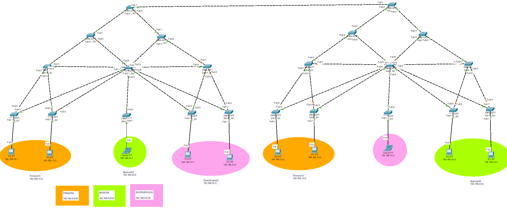

# Manual Técnico

## 1. Direcciones IP utilizadas
|**Dispositivo**|**Dirección IP**|**Máscara de Subred**|**Nombre de VLAN**|**VLAN**|
|:---:|:---:|:---:|:---:|:---:|
|192.168.13.1 | 192.168.13.1   | 255.255.255.0 | Primaria13 | 13 | 
|192.168.13.2 | 192.168.13.2   | 255.255.255.0 | Primaria13 | 13 | 
|192.168.13.3 | 192.168.13.3   | 255.255.255.0 | Primaria13 | 13 | 
|192.168.13.4 | 192.168.13.4   | 255.255.255.0 | Primaria13 | 13 | 
|192.168.23.1 | 192.168.23.1   | 255.255.255.0 | Basicos23 | 23 | 
|192.168.23.2 | 192.168.23.2   | 255.255.255.0 | Basicos23 | 23 | 
|192.168.23.3 | 192.168.23.3   | 255.255.255.0 | Basicos23 | 23 | 
|192.168.33.1 | 192.168.33.1   | 255.255.255.0 | Diversificado33 | 33 |
|192.168.33.2 | 192.168.33.2   | 255.255.255.0 | Diversificado33 | 33 |
|192.168.33.3 | 192.168.33.3   | 255.255.255.0 | Diversificado33 | 33 |

## 2. Topología de red


## 3. Comandos utilizados

##### SW1_G3 (Server / Raíz)
```
SW1_G3 -------------------------------------------------
ena
conf t
vlan 13
name Primaria13
exit
vlan 23
name Basicos23
exit
vlan 33
name Diversificado33
exit
!----- vtp -----
vtp mode server
vtp version 2
vtp domain g3
vtp password g3
int range fa 0/1-3
switchport mode trunk
switchport trunk allowed vlan all
exit
do write
```

##### SW2_G3, SW3_G3
```
SW2_G3, SW3_G3 -------------------------------
ena
conf t
!----- vtp -----
vtp mode client
vtp domain g3
vtp password g3
int range fa 0/1-3
switchport mode trunk
switchport trunk allowed vlan all
exit
do write
```


##### SW4_G3, SW6_G3
```
SW4_G3, SW6_G3 -------------------------------
ena
conf t
!----- vtp -----
vtp mode client
vtp domain g3
vtp password g3
int range fa 0/1-4
switchport mode trunk
switchport trunk allowed vlan all
exit
do write
```


##### SW5_G3
```
SW5_G3 -------------------------------
ena
conf t
!----- vtp -----
vtp mode client
vtp domain g3
vtp password g3
int range fa 0/1-9
switchport mode trunk
switchport trunk allowed vlan all
exit
do write
```

##### SW7_G3, SW8_G3
```
SW7_G3, SW8_G3 ------------------------------------------
ena
conf t
!----- vtp -----
vtp mode client
vtp domain g3
vtp password g3
int range fa 0/2-3
switchport mode trunk
switchport trunk allowed vlan all
exit
int fa 0/1
switchport mode access
switchport access vlan 13
exit
do write
```


##### SW9_G3
```
SW9_G3 ---------------------------------------------------
ena
conf t
!----- vtp -----
vtp mode client
vtp domain g3
vtp password g3
int range fa 0/2-3
switchport mode trunk
switchport trunk allowed vlan all
exit
int fa 0/1
switchport mode access
switchport access vlan 33
exit
do write
exit
```


##### SW10_G3, SW11_G3
```
SW10_G3, SW11_G3--------------------------------------------
ena
conf t
!----- vtp -----
vtp mode client
vtp domain g3
vtp password g3
int fa 0/2
switchport mode trunk
switchport trunk allowed vlan all
exit
int fa 0/1
switchport mode access
switchport access vlan 23
exit
int fa 0/1
switchport port-security
switchport port-security mac-address 000B.BED3.74C6(SW10)/0090.0C0C.6059(SW11)
exit
do write
```


##### SW12_G3, SW13_G3, SW14_G3
```
SW12_G3, SW13_G3, SW14_G3 -------------------------------
ena
conf t
!----- vtp -----
vtp mode client
vtp domain g3
vtp password g3
int range fa 0/1-3
switchport mode trunk
switchport trunk allowed vlan all
exit
do write

```

##### SW15_G3, SW17_G3
```
SW15_G3, SW17_G3 -------------------------------------------
ena
conf t
!----- vtp -----
vtp mode client
vtp domain g3
vtp password g3
int range fa 0/1-4
switchport mode trunk
switchport trunk allowed vlan all
exit
do write

```

##### SW16_G3
```
SW16_G3 ---------------------------------------------------
ena
conf t
!----- vtp -----
vtp mode client
vtp domain g3
vtp password g3
int range fa 0/1-9
switchport mode trunk
switchport trunk allowed vlan all
exit
do write

```


##### SW18_G3, SW19_G3
```
SW18_G3, SW19_G3 ------------------------------------------
ena
conf t
!----- vtp -----
vtp mode client
vtp domain g3
vtp password g3
int range fa 0/2-3
switchport mode trunk
switchport trunk allowed vlan all
exit
int fa 0/1
switchport mode access
switchport access vlan 13
exit
do write
```

##### SW20_G3
```
SW20_G3 ---------------------------------------------------
ena
conf t
!----- vtp -----
vtp mode client
vtp domain g3
vtp password g3
int fa 0/2
switchport mode trunk
switchport trunk allowed vlan all
exit
int fa 0/1
switchport mode access
switchport access vlan 23
exit
int fa 0/1
switchport port-security
switchport port-security mac-address 00D0.FF99.DE80
do write
```

##### SW21_G3, SW22_G3
```
SW21_G3, SW22_G3--------------------------------------------
ena
conf t
!----- vtp -----
vtp mode client
vtp domain g3
vtp password g3
int range fa 0/2-3
switchport mode trunk
switchport trunk allowed vlan all
exit
int fa 0/1
switchport mode access
switchport access vlan 33
exit
do write
exit
```

##### Seguridad en Switch Server

```
enable secret password
```


#####  Desactivar DTP para los puertos troncales

```
ena
conf t
int range fa0/2-24
switchport nonegotiate
exit
do write
exit
show dtp
```


## 4. Medición de convergencia


|**Escenario**|**Protocolo Spanning-Tree**|**Red Primaria**|**Red Básicos**|**Red Diversificado**|
|:---:|:---:|:---:|:---:|:---:|
|1| PVST   | 39.57s | 38.14s | 1:15.0 | 
|2 | Rapid PVST   | 50ms | 1.96s | 72 ms | 


Luego de las pruebas realizadas el protocolo rpvst es el mas eficiente, puesto que presenta un tiempo de convergencia practicamente imperceptible, lo cual es importante para tener una mejor eficiencia en la red realizada. Ademas, en comparacion con el escenario 1 los resultados son mejores, ya que en las tres ocasiones que presenta el primer escenario este sobrepaso los 30 segundos, lo cual puede ser perjudicial en ciertos momentos cruciales afectando la fiabilidad de la red y tiempos de respuesta. Por lo tanto, el protocolo rpvst es el escenario que elegimos ya que este logra garantizar la red más eficiente, rapida y confiable en la que un usuario podria esperar recibir una respuesta de forma veloz sin importar que en algun momento alguno de los enlaces presente algun error.
