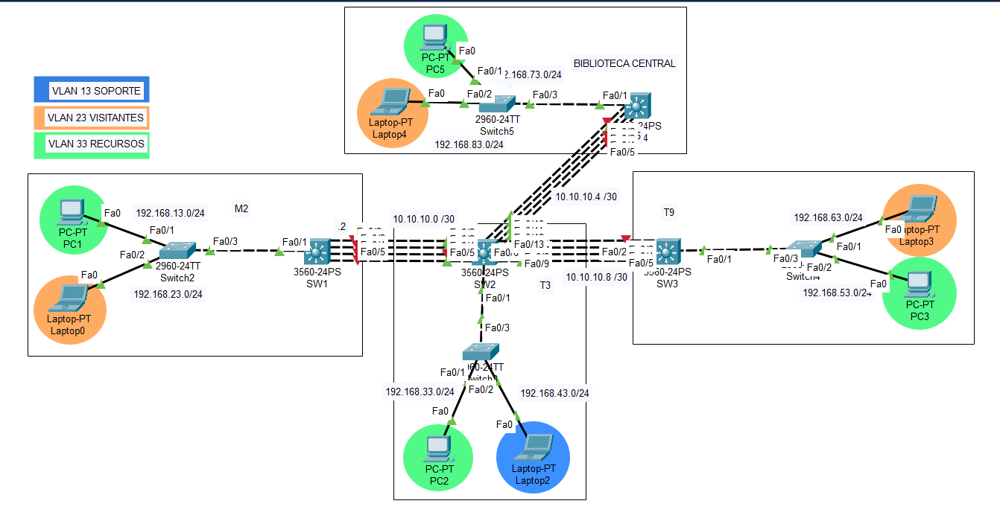

# Manual Técnico

## 1. Direcciones IP utilizadas
|**Dispositivo**|**Dirección IP**|**Máscara de Subred**|**Gateway**|**Edificio**|**VLAN**|
|:---:|:---:|:---:|:---:|:---:|:---:|
|PC1    | 192.168.13.2 | 255.255.255.0 | 192.168.13.1 | M2 | RECURSOS | 
|Laptop0| 192.168.23.2 | 255.255.255.0 | 192.168.23.1 | M2 | VISITANTES | 
|PC2    | 192.168.33.2 | 255.255.255.0 | 192.168.33.1 | T3 | RECURSOS | 
|Laptop2| 192.168.43.2 | 255.255.255.0 | 192.168.43.1 | T3 | SOPORTE | 
|PC3    | 192.168.53.2 | 255.255.255.0 | 192.168.53.1 | T9 | RECURSOS | 
|Laptop3| 192.168.63.2 | 255.255.255.0 | 192.168.63.1 | T9 | VISITANTES | 
|PC5    | 192.168.73.2 | 255.255.255.0 | 192.168.73.1 | Biblioteca | RECURSOS | 
|Laptop4| 192.168.83.2 | 255.255.255.0 | 192.168.83.1 | Biblioteca | VISITANTES |


## 2. Topología de red



## 3. Comandos utilizados

### creacion y configuracion de vlans


##### creacion vlans
```
creacion vlans -------------------------------------------------
ena
conf t
vlan 13
name SOPORTE
vlan 23
name VISITANTES
vlan 33
name RECURSOS
exit
interface vlan 13
ip address 192.168.13.1 255.255.255.0
no shut
exit
interface vlan 23
ip address 192.168.23.1 255.255.255.0
no shut
exit
interface vlan 33
ip address 192.168.33.1 255.255.255.0
no shut
exit
```


##### switch2, switch5
```
switch2, switch5 -------------------------------------------------
enable 
conf t
vlan 13
name SOPORTE
vlan 23
name VISITANTES
vlan 33
name RECURSOS
interface FastEthernet 0/1
switchport mode access
switchport access vlan 33
interface FastEthernet 0/2
switchport mode access
switchport access vlan 23
interface FastEthernet 0/3
switchport mode trunk
switchport trunk allowed vlan 13,23,33
do wr
end
```


##### switch4
```
switch4 -------------------------------------------------
enable 
conf t
vlan 13
name SOPORTE
vlan 23
name VISITANTES
vlan 33
name RECURSOS
interface FastEthernet 0/1
switchport mode access
switchport access vlan 23
interface FastEthernet 0/2
switchport mode access
switchport access vlan 33
interface FastEthernet 0/3
switchport mode trunk
switchport trunk allowed vlan 13,23,33
do wr
end
```


##### switch3
```
switch3 -------------------------------------------------
enable 
conf t
vlan 13
name SOPORTE
vlan 23
name VISITANTES
vlan 33
name RECURSOS
interface FastEthernet 0/1
switchport mode access
switchport access vlan 33
interface FastEthernet 0/2
switchport mode access
switchport access vlan 13
interface FastEthernet 0/3
switchport mode trunk
switchport trunk allowed vlan 13,23,33
do wr
end
```


##### SW1
```
SW1 -------------------------------------------------
enable
conf t
ip routing
! Configurar puertos como trunk para permitir VLANs entre switches L2 y L3
interface FastEthernet 0/1
switchport trunk encapsulation dot1q
 switchport mode trunk
 no shutdown
! PUERTOS HACIA OTROS L3 
interface Port-channel1
 no switchport
 ip address 10.10.10.2 255.255.255.252
 no shutdown
exit
vlan 13
name SOPORTE
vlan 23
name VISITANTES
vlan 33
name RECURSOS
interface vlan 23
 ip address 192.168.23.1 255.255.255.0  
 no shutdown
interface vlan 33
 ip address 192.168.13.1 255.255.255.0  
 no shutdown
! Guardar configuración
do wr
end
```


##### SW4
```
SW4 -------------------------------------------------
enable
conf t
ip routing
! Configurar puertos como trunk para permitir VLANs entre switches L2 y L3
interface FastEthernet 0/1
switchport trunk encapsulation dot1q
 switchport mode trunk
 no shutdown
! PUERTOS HACIA OTROS L3 
interface Port-channel1
 no switchport
 ip address 10.10.10.6 255.255.255.252
 no shutdown
exit
vlan 13
name SOPORTE
vlan 23
name VISITANTES
vlan 33
name RECURSOS
interface vlan 23
 ip address 192.168.83.1 255.255.255.0  
 no shutdown
interface vlan 33
 ip address 192.168.73.1 255.255.255.0  
 no shutdown
! Guardar configuración
do wr
end
```


##### SW3
```
SW3 -------------------------------------------------
enable
conf t
ip routing
! Configurar puertos como trunk para permitir VLANs entre switches L2 y L3
interface FastEthernet 0/1
switchport trunk encapsulation dot1q
 switchport mode trunk
 no shutdown
! PUERTOS HACIA OTROS L3 
interface Port-channel1
 no switchport
 ip address 10.10.10.10 255.255.255.252
 no shutdown
exit
vlan 13
name SOPORTE
vlan 23
name VISITANTES
vlan 33
name RECURSOS
interface vlan 23
 ip address 192.168.63.1 255.255.255.0  
 no shutdown
interface vlan 33
 ip address 192.168.53.1 255.255.255.0  
 no shutdown
! Guardar configuración
do wr
end
```


##### SW2
```
SW2 -------------------------------------------------
enable
conf t
ip routing
! Configurar puertos como trunk para permitir VLANs entre switches L2 y L3
interface FastEthernet 0/1
switchport trunk encapsulation dot1q
 switchport mode trunk
 no shutdown
! PUERTOS HACIA OTROS L3 
interface Port-channel1
 no switchport
 ip address 10.10.10.1 255.255.255.252
 no shutdown
interface Port-channel2
 no switchport
 ip address 10.10.10.9 255.255.255.252
 no shutdown
interface Port-channel3
 no switchport
 ip address 10.10.10.5 255.255.255.252
 no shutdown
exit
vlan 13
name SOPORTE
vlan 23
name VISITANTES
vlan 33
name RECURSOS
interface vlan 13
 ip address 192.168.43.1 255.255.255.0  
 no shutdown
interface vlan 33
 ip address 192.168.33.1 255.255.255.0  
 no shutdown
! Guardar configuración
do wr
end
```

###  LACP

La configuracion de LACP permitió combinar múltiples enlaces en los switches de capa 3 para que actúen como un solo enlace lógico, de este modo, fue util para la realizacion de los ruteos.

##### SW2
```
SW2 -------------------------------------------------
ena
conf t
int range fa0/2-5
channel-protocol lacp
channel-group 1 mode active
exit
int range fa0/6-9
channel-protocol lacp
channel-group 2 mode active
exit
int range fa0/10-13
channel-protocol lacp
channel-group 3 mode active
exit
do wr
```


##### SW1, SW3, SW4
```
SW1, SW3, SW4 -------------------------------------------------
ena
conf t
int range fa0/2-5
channel-protocol lacp
channel-group 1 mode passive
exit
do wr
```


### Ruteo Eigrp


##### SW1
```
SW1 -------------------------------------------------
en
conf t
router eigrp 3
network 192.168.13.0 0.0.0.255
network 192.168.23.0 0.0.0.255
network 10.10.10.0 0.0.0.3
no auto-summary
exit
do wr
```


##### SW2
```
SW2 -------------------------------------------------
en
conf t
router eigrp 3
network 192.168.33.0 0.0.0.255
network 192.168.43.0 0.0.0.255
network 10.10.10.0 0.0.0.3
network 10.10.10.4 0.0.0.3
network 10.10.10.8 0.0.0.3
no auto-summary
exit
do wr
```


##### SW3
```
SW3 -------------------------------------------------
en
conf t
router eigrp 3
network 192.168.63.0 0.0.0.255
network 192.168.53.0 0.0.0.255
network 10.10.10.8 0.0.0.3
no auto-summary
exit
do wr
```


##### SW4
```
SW4 -------------------------------------------------
en
conf t
router eigrp 3
network 192.168.73.0 0.0.0.255
network 192.168.83.0 0.0.0.255
network 10.10.10.4 0.0.0.3
no auto-summary
exit
do wr
```


### KeyChain en ruteo EIGRP

Se hizo uso de keychain para poder autenticar de manera segura los vecinos EIGRP por medio de claves dinamicas, de este modo, solo switches de capa 3 que comparten la misma clave pueden compartir informacion de enrutamiento.

```
KeyChain -------------------------------------------------
en 
conf t
key chain llavero_g3
key 3
key-string redes2-g3
exit
exit
do wr
```


### Ruteo OSPF


##### SW1
```
SW1 -------------------------------------------------
en
conf t
router ospf 1
network 192.168.13.0 0.0.0.255 area 3
network 192.168.23.0 0.0.0.255 area 3
network 10.10.10.0 0.0.0.3 area 3
area 3 authentication message-digest
do wr
end
```


##### SW2
```
SW2 -------------------------------------------------
en
conf t
router ospf 1
network 192.168.33.0 0.0.0.255 area 3
network 192.168.43.0 0.0.0.255 area 3
network 10.10.10.0 0.0.0.3 area 3
network 10.10.10.4 0.0.0.3 area 3
network 10.10.10.8 0.0.0.3 area 3
area 3 authentication message-digest
do wr
end
```


##### SW3
```
SW3 -------------------------------------------------
en
conf t
router ospf 1
network 192.168.63.0 0.0.0.255 area 3
network 192.168.53.0 0.0.0.255 area 3
network 10.10.10.8 0.0.0.3 area 3
area 3 authentication message-digest
do wr
end
```


##### SW4
```
SW4 -------------------------------------------------
en
conf t
router ospf 1
network 192.168.73.0 0.0.0.255 area 3
network 192.168.83.0 0.0.0.255 area 3
network 10.10.10.4 0.0.0.3 area 3
area 3 authentication message-digest
do wr
end
```


### MD5 en ruteo OSPF

MD5 es util en el ruteo para poder autenticar los switches de caoa 3 que son parte del enrutamiento OSPF.

```
md5 -------------------------------------------------
en
conf t
interface port-channel 1
ip ospf message-digest-key 1 md5 redes2-g3
ex
do wr


! Comando de verificacion
show ip ospf interface

```


### Listas de control de acceso

Se realizaron en esta practica las siguientes restricciones de comunicaciones:

- La VLAN de SOPORTE tiene comunicación con todas las demás VLAN’s
de la red, pero las demás VLANs (VISITANTES, RECURSOS) no tienen
comunicación con la VLAN de SOPORTE.
- La VLAN de RECURSOS tiene comunicación con la VLAN de RECURSOS de
los demás edificios.
- La VLAN VISITANTES esta completamente aislada de las demás VLANs
para mantener los dispositivos externos fuera de las redes internas.

Para esto se usaron diversos comandos que se especifican a continuacion.


```
SW1  -------------------------------------------------
en
conf t
access-list 103 deny icmp 192.168.23.0 0.0.0.255 192.168.13.0 0.0.0.255 echo
int port-channel1 
ip access-group 3 in
```


```
 SW1 - VLAN RECURSOS -------------------------------------------------
access-list 103 deny icmp 192.168.13.0 0.0.0.255 192.168.43.0 0.0.0.255 echo
no access-list 103 permit icmp 192.168.13.0 0.0.0.255 192.168.43.0 0.0.0.255 echo-reply
access-list 103 deny icmp 192.168.23.0 0.0.0.255 192.168.43.0 0.0.0.255 echo
no access-list 103 permit icmp 192.168.23.0 0.0.0.255 192.168.43.0 0.0.0.255 echo-reply
int port-channel1
ip access-group 103 out
exit
```


```
VLAN VERDE M2 -------------------------------------------------
access-list 103 permit icmp 192.168.13.0 0.0.0.255 192.168.73.0 0.0.0.255 echo
no access-list 103 permit icmp 192.168.13.0 0.0.0.255 192.168.73.0 0.0.0.255 echo-reply
access-list 103 permit icmp 192.168.13.0 0.0.0.255 192.168.53.0 0.0.0.255 echo
no access-list 103 permit icmp 192.168.13.0 0.0.0.255 192.168.53.0 0.0.0.255 echo-reply
access-list 103 permit icmp 192.168.13.0 0.0.0.255 192.168.33.0 0.0.0.255 echo
no access-list 103 permit icmp 192.168.13.0 0.0.0.255 192.168.33.0 0.0.0.255 echo-reply
access-list 103 deny icmp 192.168.13.0 0.0.0.255 any echo
```


```
VLAN VERDE Biblioteca -------------------------------------------------
access-list 103 permit icmp 192.168.73.0 0.0.0.255 192.168.13.0 0.0.0.255 echo
no access-list 103 permit icmp 192.168.73.0 0.0.0.255 192.168.13.0 0.0.0.255 echo-reply
access-list 103 permit icmp 192.168.73.0 0.0.0.255 192.168.53.0 0.0.0.255 echo
no access-list 103 permit icmp 192.168.73.0 0.0.0.255 192.168.53.0 0.0.0.255 echo-reply
access-list 103 permit icmp 192.168.73.0 0.0.0.255 192.168.33.0 0.0.0.255 echo
no access-list 103 permit icmp 192.168.73.0 0.0.0.255 192.168.33.0 0.0.0.255 echo-reply
access-list 103 deny icmp 192.168.73.0 0.0.0.255 any echo
```


```
VLAN VERDE T9 -------------------------------------------------
access-list 103 permit icmp 192.168.53.0 0.0.0.255 192.168.73.0 0.0.0.255 echo
no access-list 103 permit icmp 192.168.53.0 0.0.0.255 192.168.73.0 0.0.0.255 echo-reply
access-list 103 permit icmp 192.168.53.0 0.0.0.255 192.168.13.0 0.0.0.255 echo
no access-list 103 permit icmp 192.168.53.0 0.0.0.255 192.168.13.0 0.0.0.255 echo-reply
access-list 103 permit icmp 192.168.53.0 0.0.0.255 192.168.33.0 0.0.0.255 echo
no access-list 103 permit icmp 192.168.53.0 0.0.0.255 192.168.33.0 0.0.0.255 echo-reply
access-list 103 deny icmp 192.168.53.0 0.0.0.255 any echo
access-list 103 permit icmp any any echo-reply
```

```
SW3 - VLAN RECURSOS -------------------------------------------------
access-list 103 deny icmp 192.168.63.0 0.0.0.255 192.168.43.0 0.0.0.255 echo
no access-list 103 permit icmp 192.168.63.0 0.0.0.255 192.168.43.0 0.0.0.255 echo-reply
access-list 103 deny icmp 192.168.53.0 0.0.0.255 192.168.43.0 0.0.0.255 echo
no access-list 103 permit icmp 192.168.53.0 0.0.0.255 192.168.43.0 0.0.0.255 echo-reply
int port-channel1
ip access-group 103 out
exit
```


```
SW4 - VLAN RECURSOS -------------------------------------------------
access-list 103 deny icmp 192.168.73.0 0.0.0.255 192.168.43.0 0.0.0.255 echo
no access-list 103 permit icmp 192.168.73.0 0.0.0.255 192.168.43.0 0.0.0.255 echo-reply
access-list 103 deny icmp 192.168.83.0 0.0.0.255 192.168.43.0 0.0.0.255 echo
no access-list 103 permit icmp 192.168.83.0 0.0.0.255 192.168.43.0 0.0.0.255 echo-reply
int port-channel1
ip access-group 103 out
exit
```


```
SW2 -------------------------------------------------
access-list 103 permit icmp 192.168.43.0 0.0.0.255 any echo
```


```
VLAN VERDE T3 -------------------------------------------------
access-list 103 permit icmp 192.168.33.0 0.0.0.255 192.168.73.0 0.0.0.255 echo
access-list 103 permit icmp 192.168.33.0 0.0.0.255 192.168.13.0 0.0.0.255 echo
access-list 103 permit icmp 192.168.33.0 0.0.0.255 192.168.53.0 0.0.0.255 echo
access-list 103 deny icmp 192.168.33.0 0.0.0.255 any echo
access-list 103 deny icmp 192.168.33.0 0.0.0.255 192.168.43.0 0.0.0.255 echo-reply
access-list 103 permit icmp any any echo-reply
int port-channel1
ip access-group 103 out
exit
int port-channel2
ip access-group 103 out
exit
int port-channel3
ip access-group 103 out
exit
```


```
visitantes -------------------------------------------------
access-list 103 deny icmp 192.168.23.0 0.0.0.255 any echo
access-list 103 deny icmp 192.168.83.0 0.0.0.255 any echo
access-list 103 deny icmp 192.168.63.0 0.0.0.255 any echo
```